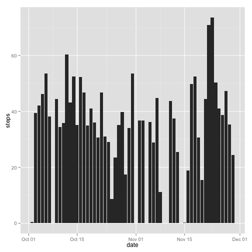
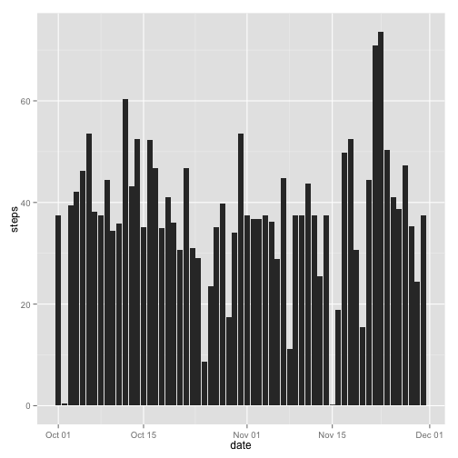
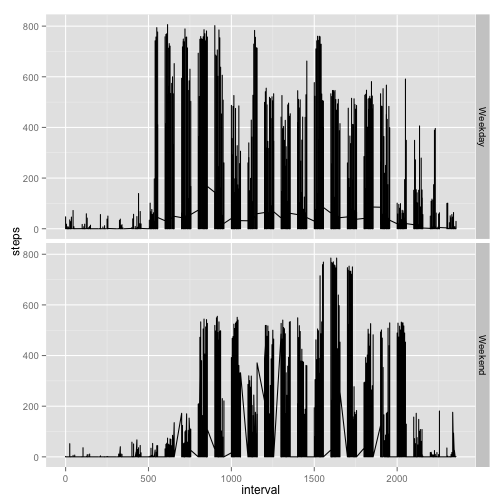

# Loading and preprocessing the data
1 Load the data (i.e. read.csv())

```r
zipfile = "activity.zip"
csvfile = "activity.csv"
if(!file.exists(csvfile)){
    if(file.exists(zipfile)){
        unzip(zipfile)
    }
}
activity <- read.csv(csvfile)
```

2 Process/transform the data (if necessary) into a format suitable for your analysis. The date is formatted to a Date class.

```r
timeformat <- "%Y-%m-%d"
activity$date <- as.Date(activity$date, timeformat)
```


# What is mean total number of steps taken per day?
1 Make a histogram of the total number of steps taken each day

```r
require(plyr)
require(dplyr)
require(ggplot2)
```

```r
totalStepsPerDay <- summarize(group_by(activity, date),
                              steps = mean(steps,na.rm = TRUE))
ggplot(subset(totalStepsPerDay, !is.na(steps)), aes(x = date, y = steps)) +
    geom_bar(stat = "identity")
```

 

2 Calculate and report the mean and median total number of steps taken per day

```r
mean(totalStepsPerDay$steps, na.rm = TRUE)
```

```
## [1] 37.3826
```

```r
median(totalStepsPerDay$steps, na.rm = TRUE)
```

```
## [1] 37.37847
```


# What is the average daily activity pattern?
1 Make a time series plot of the 5-minute interval (x-axis) and the average number of steps taken, averaged across all days (y-axis)

```r
stepsPerInterval <- summarize(group_by(activity, interval),
                              steps = mean(steps, na.rm = TRUE))
plot(x=stepsPerInterval$interval,
     y = stepsPerInterval$steps,
     type="l",
     xlab="interval",
     ylab="steps")
```

 

2 Which 5-minute interval, on average across all the days in the dataset, contains the maximum number of steps?

```r
filter(stepsPerInterval, steps == max(steps))
```

```
## Source: local data frame [1 x 2]
## 
##   interval    steps
## 1      835 206.1698
```


# Imputing missing values
1 Calculate and report the total number of missing values in the dataset (i.e. the total number of rows with NAs)

```r
sum(is.na(activity$steps))
```

```
## [1] 2304
```

2 Devise a strategy for filling in all of the missing values in the dataset. The strategy does not need to be sophisticated.
The chosen strategy is to fill the missing values with the mean of the 5-minute interval. The mean per interval is already calculated in stepsPerInterval dataframe, so it will try to match the interval with missing value to the other dataframe containing the mean of that specific interval.  
3 Create a new dataset that is equal to the original dataset but with the missing data filled in.

```r
activityNoMissingData <- activity
activityNoMissingData$steps <- ifelse(
    is.na(activityNoMissingData$steps),
    stepsPerInterval[match(activityNoMissingData$interval,
              stepsPerInterval$interval),]$steps,
    activityNoMissingData$steps)
```

4 Make a histogram of the total number of steps taken each day

```r
totalStepsPerDay2 <- summarize(group_by(activityNoMissingData, date),
                               steps = mean(steps))
ggplot(totalStepsPerDay2, aes(x = date, y = steps)) +
    geom_bar(stat = "identity")
```

 

Calculate and report the mean and median total number of steps taken per day.

```r
mean(totalStepsPerDay2$steps)
```

```
## [1] 37.3826
```

```r
median(totalStepsPerDay2$steps)
```

```
## [1] 37.3826
```

Do these values differ from the estimates from the first part of the assignment? What is the impact of imputing missing data on the estimates of the total daily number of steps?

```r
mean(totalStepsPerDay2$steps) - mean(totalStepsPerDay$steps, na.rm = TRUE)
```

```
## [1] 0
```

```r
median(totalStepsPerDay2$steps) - median(totalStepsPerDay$steps, na.rm = TRUE)
```

```
## [1] 0.004127358
```


# Are there differences in activity patterns between weekdays and weekends?
1 Create a new factor variable in the dataset with two levels -- "weekday" and "weekend" indicating whether a given date is a weekday or weekend day.

```r
activityNoMissingData$day <- ifelse(
    weekdays(activityNoMissingData$date) == "Saturday",
    "Weekend",
    ifelse(weekdays(activityNoMissingData$date) == "Sunday",
           "Weekend",
           "Weekday"))
```

2 Make a panel plot containing a time series plot of the 5-minute interval (x-axis) and the average number of steps taken, averaged across all weekday days or weekend days (y-axis). Note that the example plot was made using the lattice system but you can make the same version of the plot using any plotting system you choose.

```r
ggplot(activityNoMissingData, aes(x=interval, y=steps)) +
    geom_line() +
    facet_grid(day ~ .)
```

 
